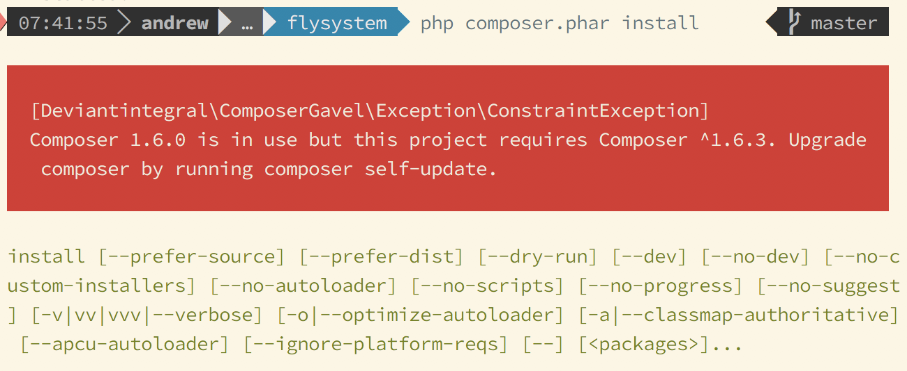

# Composer Gavel

[](https://thenounproject.com/search/?q=gavel&i=131778)

_I judge your Composer to be insufficent_

[](https://circleci.com/gh/deviantintegral/composer-gavel) [](https://codeclimate.com/github/deviantintegral/composer-gavel/maintainability) [](https://codeclimate.com/github/deviantintegral/composer-gavel/test_coverage)

## Rationale

We've worked on many projects with larger teams where developers end up with
multiple versions of composer all over their local environments. This plugin
will ensure that composer version warnings can't be ignored by developers, which
is especially useful when developers need to run `composer update`.

## Usage

### Add plugin and update other dependencies

1. `$ composer require deviantintegral/composer-gavel`
1. `$ composer update`

### Add without updating anything

1. `$ composer require deviantintegral/composer-gavel`
1. Edit `composer.json` and add `composer-version` to the `extra` section, with
   a version constraint:
   ```json
      "extra": {
          "composer-version": "^1.6.3"
      }
   ```
1. `$ composer update --lock` # Update the lockfile hash.

When the running composer version does not satisfy the constraint, an error
will be thrown.



It's recommended to require this plugin on a per-project basis instead of
globally.
